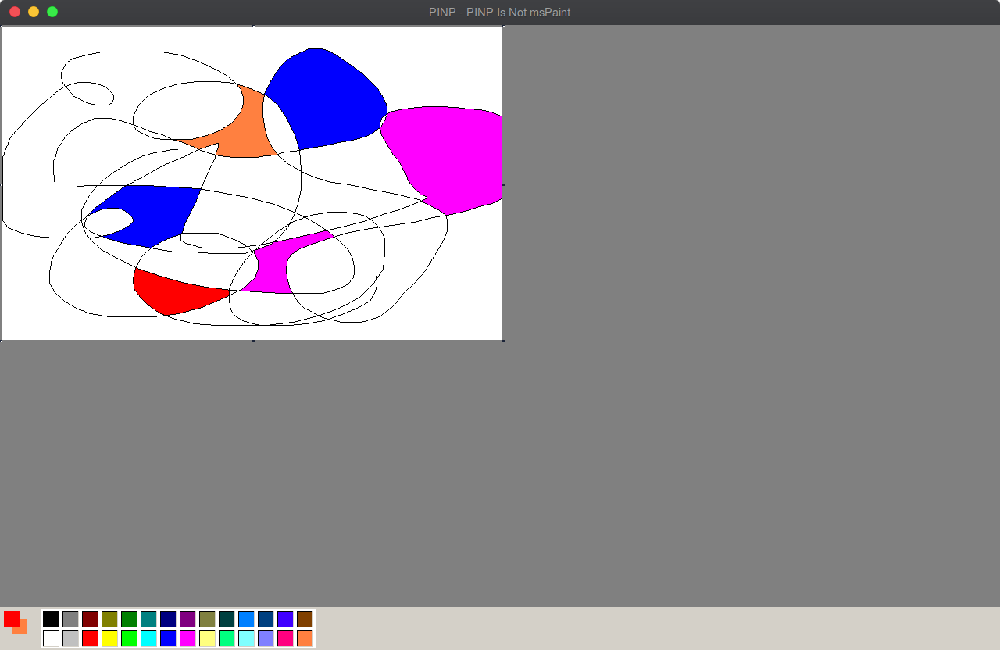

# PINP
 

PINP Is Not msPaint

</img>

## Install

The following steps covers the setup process

### Using pyenv with pyenv-virtualenv

You also should use virtualenv to build/develop the project and I recommend the use of [pyenv](https://github.com/pyenv/pyenv) with [pyenv-virtualenv](https://github.com/pyenv/pyenv-virtualenv) to manage multiple python environments.

```bash
pyenv install 3.7.6
pyenv virtualenv 3.7.6 PINP
pyenv activate PINP
```

If you have any problems installing pyenv try [these common solutions](https://github.com/pyenv/pyenv/wiki/Common-build-problems).

### Installing dependencies (Python 3.7.6)

Open your bash and run the follow command to install all the project dependencies, you just need to run the command one time

```bash
(PINP) $ python -m pip install -r requirements.txt
```

## Base Algorithms

https://en.m.wikipedia.org/wiki/Flood_fill
